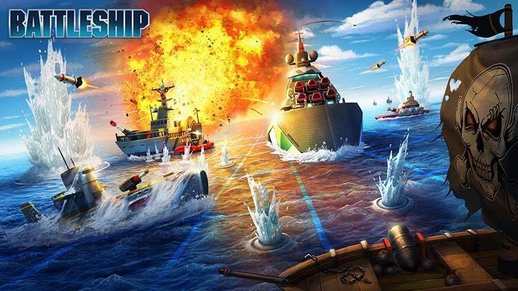

# Battleship Video Game

This project is a custom Python implementation of the classic game "Battleship".

## Game Overview

This version of Battleship introduces a few unique characteristics to simplify development while maintaining the core gameplay.

## Project Structure

The project is organized into the following main directories:

- `/docs`: Contains project public presentations (in spanish).
- `/src` : Contains the source code organized as follows:

    - `class_Barco.py`: Defines the Barco (Ship) class, which represents the ships in the game. Each ship has a specific size and position on the grid. This class checks for hits and misses.
    - `class_Tablero.py`: Defines the Tablero (Board) class, which manages the 10x10 grid for each player. This class handles ship placement. 
    - `functions.py`: Includes an utility function that assist with coordenates handle.
    - `variables.py`: Holds global variables used throughout the game, such as grid dimensions, the number of ships, and user's lifes.
    - `main.py`: Contains the main game loop and logic that coordinates gameplay between the player and the AI. This is the entry point to run the game.

## Key Features

1. Two Players: The game is played between you (the user) and the computer (AI).

2. 10x10 Grid: Both players have a 10x10 grid where their ships are placed.

3. Ship Placement: Ships are placed randomly on the grid. The ships are as follows:
    * 4 ships with a length of 1 cell
    * 3 ships with a length of 2 cells
    * 2 ships with a length of 3 cells
    * 1 ship with a length of 4 cells

4. Turn-Based Gameplay: Both players take turns firing at each other's grid. The goal is to sink all of the opponent's ships. The first player to lose all their ships loses the game.

5. Your Turn: You start first. Each turn, you shoot at a coordinate (X, Y) on the enemy grid. If you hit a ship, you get another turn. If you miss, the turn passes to the AI.

6. AI's Turn: The AI also shoots at random coordinates on your grid. If the AI hits, it gets another turn.

7. Game End: The game ends when all of a player's ships are sunk, and the other player is declared the winner.

For an online version of the game, feel free to visit [this link](http://es.battleship-game.org/).

---

This project focuses on building a fun and challenging Battleship game using Python. If you have any questions, suggestions, or feedback, feel free to reach out to the team.