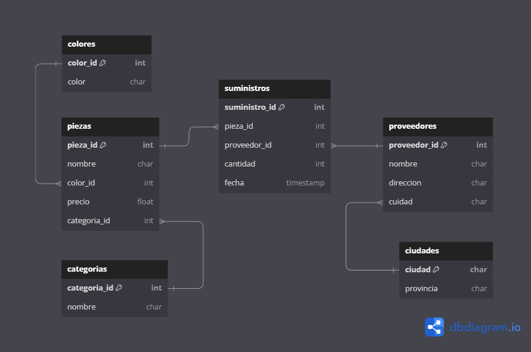

# Databases Management with SQLite3

This project consists of two distinct components centered on database management and practical SQL applications.

## Part I - SQL Murder Mystery Game

In [this exercise](./murder_in_SQL_city), you will investigate a murder in SQL City. Through solving this case, you'll apply SQL concepts and queries. The engaging game, created by **Joon Park and Cathy He**, challenges your SQL skills in a fun, interactive way. For more details, please visit the official website: [SQL Murder Mystery](http://mystery.knightlab.com).

### Structure

The project is organized into three main components:

* `/data`: Contains the .db file with the database used for the investigation.
* `/doc`: A brief presentation with the solution to the murder case (in spanish).
* `murder_in_SQL_city.ipynb`: A Jupyter notebook that walks you through the solution step by step.

### Instructions

* SQL Murder Mystery: Open the **murder_in_SQL_city.ipynb** file in Jupyter Notebook and follow the step-by-step guide to solving the case using SQL queries.

## Part II - Database Modeling: Creation and Maintenance of a Database with SQL

In [this section](./SQL_database_design), you will design and manage a database model that stores information about suppliers and the parts they provide. This involves creating SQL tables, defining fields and data types, and establishing relationships between the entities in the database.

### Database Requirements

We need to design a database to manage suppliers, with the following details available:

* Supplier Information:
    * Name
    * Address
    * City
    * Province
    * Unique Supplier Code (identifier for each supplier)

We need to track the parts supplied by each provider, noting both the quantity and the date of supply. A supplier can provide the same part (identified by a unique code) on different dates, and multiple suppliers can provide the same part. The database design must allow us to store the entire history of supplies with quantities and dates.

* Part Information:
    * Unique Part Code
    * Name
    * Color
    * Price
    * Category

* Each part belongs to a single category, and categories have:
    * Unique Category Code
    * Name
    * Database Model

### Database Structure

The following diagram represents the structure of the database (in spanish because db requierements):

### Project Structure

The project is organized into the following main directories:

* `/img`: Contains the database structure diagram.
* `/src`: Contains the source code and data organized as follows:
    * `/data`: Contains .csv files with suplier information and de **.db** file itself.
    * `main.py`: Main script for database creation/connection, table creation, data insertion, data retrieval, and saving/closing the database.
    * `functions.py`: Contains a function to insert data from a CSV file into an SQLite database table.
    * `db_check.ipynb`: A simple Jupyter Notebook that demonstrates some of the database capabilities.

### Instructions

* Database Model: Use the scripts in the /src folder to create and manage the supplier-part database. You can run the notebook **db_check.ipynb** to explore some of the database's features.

---

Feel free to explore the directories and files for a detailed understanding of the project. If you have any questions or suggestions, please feel free to reach out.