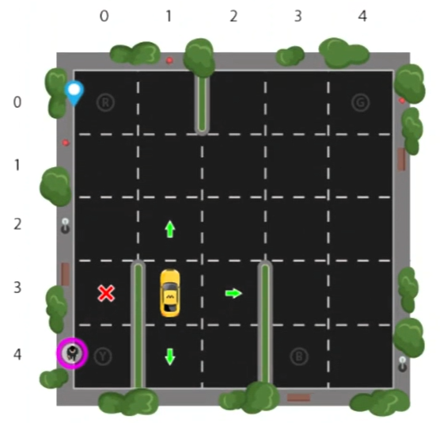

# Taxi autónomo: Aprendizaje por refuerzo mediante Q-Learning

Este proyecto implementa un sistema de taxi autónomo (SmartCab) que utiliza algoritmos de aprendizaje por refuerzo para aprender a recoger y dejar pasajeros de manera eficiente y segura en un entorno simulado. El entorno ha sido desarrollado utilizando la librería [Gymnasium](https://gymnasium.farama.org/index.html) de [OpenAI](https://openai.com/).

## Objetivo

El objetivo del SmartCab es realizar las siguientes tareas:

- Recoger pasajeros en ubicaciones designadas.
- Dejar a los pasajeros en su destino correcto.
- Optimizar el tiempo de traslado (evitando acciones inválidas).

## Algoritmos Implementados

El proyecto incluye una comparación entre:

1. Movimientos aleatorios: El taxi toma acciones sin ningún conocimiento previo ni aprendizaje.
2. Aprendizaje por refuerzo: El taxi aprende a maximizar las recompensas acumuladas mediante la construcción de una tabla-Q.

## Resultados

El aprendizaje por refuerzo con Q-Learning muestra una mejora significativa en la eficiencia del taxi en comparación con los movimientos aleatorios, logrando mayores recompensas y reduciendo notablemente el tiempo de traslado.
